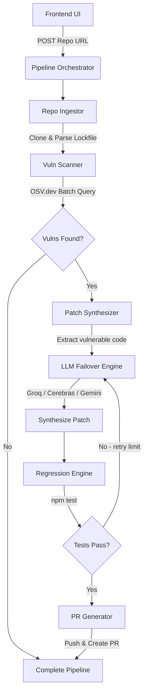

<div align="center">

<br />

```
  █████╗ ███████╗ ██████╗ ██╗███████╗    ██████╗  █████╗ ████████╗ ██████╗██╗  ██╗
 ██╔══██╗██╔════╝██╔════╝ ██║██╔════╝    ██╔══██╗██╔══██╗╚══██╔══╝██╔════╝██║  ██║
 ███████║█████╗  ██║  ███╗██║███████╗    ██████╔╝███████║   ██║   ██║     ███████║
 ██╔══██║██╔══╝  ██║   ██║██║╚════██║    ██╔═══╝ ██╔══██║   ██║   ██║     ██╔══██║
 ██║  ██║███████╗╚██████╔╝██║███████║    ██║     ██║  ██║   ██║   ╚██████╗██║  ██║
 ╚═╝  ╚═╝╚══════╝ ╚═════╝ ╚═╝╚══════╝    ╚═╝     ╚═╝  ╚═╝   ╚═╝    ╚═════╝╚═╝  ╚═╝
```

**An Autonomous Engine for Generative Intelligent Security Patching.**

*Submit a repository. We detect vulnerabilities, synthesize patches, run regression tests, and open Pull Requests — with zero human intervention.*

<br />

[](https://nodejs.org/)
[](https://nextjs.org/)
[](https://groq.com/)
[](https://deepmind.google/technologies/gemini/)
[](https://osv.dev/)
[](https://tailwindcss.com/)

</div>

---

## What is AEGIS-PATCH?

AEGIS-PATCH natively **replaces hours of manual vulnerability triage and patching** by acting as an autonomous security engineer. It continuously monitors, identifies, and resolves dependency and code-level vulnerabilities in your JavaScript/Node.js repositories.

You input a GitHub repository URL, and AEGIS-PATCH executes a complete pipeline:

- Generates a **dependency graph** directly from lockfiles
- Cross-references packages against the live **OSV.dev vulnerability database**
- Pipes vulnerable source files into a **4-tier LLM failover engine** to synthesize secure, drop-in replacement code
- Executes local **regression tests** to guarantee the patch doesn't break existing functionality
- Automatically pushes the patched code and **generates a GitHub Pull Request**
- Streams the entire process in real-time to a stunning, **IDE-like dashboard**

---

## ✨ Core Feature Set

### 🧠 4-Tier LLM Failover Engine (High-Availability Patching)
Patch synthesis requires high uptime and deep reasoning. AEGIS-PATCH uses a cascaded fallback architecture to ensure a patch is always generated, even if primary APIs hit rate limits or downtime.
**Routing:** Groq (`llama-3.3-70b-versatile`) → Cerebras → Gemini (`gemini-2.5-flash`).

### 🔍 Deep OSV Scanner
Instead of relying solely on `npm audit`, AEGIS-PATCH parses `package-lock.json` lockfiles directly to build a highly accurate dependency graph. It batches these dependencies and queries the Open Source Vulnerability (OSV.dev) database to extract precise CVSS scores, vulnerable ranges, and CVE identifiers.

### 🛠️ Smart Patch Synthesis
Once a vulnerability is found, AEGIS-PATCH locates the exact vulnerable entry point in the package's source code. It feeds the raw code, the CVE details, and strict constraints into the LLM engine to synthesize a **semantically equivalent but secure** replacement.

### 🛡️ Regression Engine
A patch is useless if it breaks the build. AEGIS-PATCH runs the repository's native test suite (`npm test`, Mocha, Jest) against the newly patched code in an isolated temp directory. If tests fail, it captures the `stderr`, feeds it back into the LLM, and iterates until the tests pass.

### 🔄 Auto-PR Generation
Zero human intervention required. Once the tests pass, AEGIS-PATCH configures a secure remote, commits the patched code to a new branch, pushes to GitHub, and uses the GitHub REST API to open a detailed Pull Request outlining the CVEs fixed, CVSS scores, and testing results.

### 💻 Real-time Execution Dashboard
Watch the autonomous agent work. The Next.js frontend connects via WebSockets to stream the live pipeline logs, current stage indicators (CLONING → SCANNING → PATCHING → TESTING → COMPLETE), and dynamic vulnerability cards showing severity and CVSS scores as they are discovered.

---

## 🛠️ Technology Stack

### ⚡ Backend & Infrastructure
| Layer | Technology |
|---|---|
| Server Runtime | Node.js (Raw `http` + Event-driven architecture) |
| Real-time Comm | `ws` (WebSockets) |
| Orchestration | Native child processes (`execFile`) for safe isolation |
| HTTP Client | `undici` (high-performance fetch) |

### 🎨 Frontend & UI
| Layer | Technology |
|---|---|
| Framework | Next.js 15 (App Router) |
| Styling | Tailwind CSS v4 |
| Theme | Deep void dark mode, glassmorphism, pulse animations |
| State | React Hooks (`useEffect`, `useState`) + Custom WebSocket hooks |

### 🧠 Intelligence & Data
| Layer | Technology |
|---|---|
| Vulnerability DB | OSV.dev REST API |
| LLM Orchestration | Custom Failover Pipeline (Groq, Cerebras, Gemini) |
| Git Integration | `simple-git` + Octokit (GitHub API) |

---

## 🗺️ Pipeline Architecture



---

## 🏗️ Project Structure

```
.
├── backend/
│   ├── server.js                 # HTTP + WebSocket entry point
│   ├── src/
│   │   ├── core/                 # Config, Pipeline Orchestrator, EventBus
│   │   ├── llm/                  # Prompts, Failover logic, Provider integrations
│   │   ├── modules/              # Ingestion, Scanning, Patching, Regression, PRs
│   │   └── utils/                # Logger, Process Runner, depGraph parser
│   └── temp/                     # Isolated clone directories (auto-cleaned)
│
├── frontend/
│   ├── src/
│   │   ├── app/                  # Next.js App Router (page.js, globals.css, layout)
│   │   ├── components/           # Terminal, StatusPanel, VulnCard, UrlInput
│   │   └── lib/                  # WebSocket hook, Log formatters
│   └── public/                   # Static assets
│
└── task-distribution.md          # Internal team task tracking
```

---

## 🚀 Getting Started

### Prerequisites
- **Node.js** 18+
- **Git** installed and available in PATH
- **GitHub Personal Access Token** (with `repo` scope)
- At least one **LLM API Key** (Groq, Cerebras, or Gemini)

### 1. Clone & Install

```bash
git clone https://github.com/Jaimin2687/aegis-patch.git
cd aegis-patch
```

Install Backend Dependencies:
```bash
cd backend
npm install
```

Install Frontend Dependencies:
```bash
cd ../frontend
npm install
```

### 2. Environment Configuration

In the `backend/` directory, create a `.env` file:

```env
# LLM API Keys (all free tier)
GROQ_API_KEY=gsk_your_key_here
GEMINI_API_KEY=AIzaSy_your_key_here
CEREBRAS_API_KEY=csk-your_key_here

# GitHub Personal Access Token (repo scope - needed to open PRs)
GITHUB_TOKEN=ghp_your_token_here

# Server Config
PORT=3001
FRONTEND_URL=http://localhost:3000

# Pipeline Config
MAX_RETRIES=5
TEST_TIMEOUT_MS=30000
MAX_MEMORY_MB=512
```

### 3. Run Locally

You need to run both the backend and frontend simultaneously.

**Start Backend (Port 3001):**
```bash
cd backend
npm start
```

**Start Frontend (Port 3000):**
```bash
cd frontend
npm run dev
```

Open `http://localhost:3000` in your browser. Paste a vulnerable repository URL and watch AEGIS-PATCH go to work.

---

<div align="center">

**Built for the modern security architect. Focus on shipping, let AI handle the patching.**

*AEGIS-PATCH — © 2026 All Rights Reserved*

</div>
